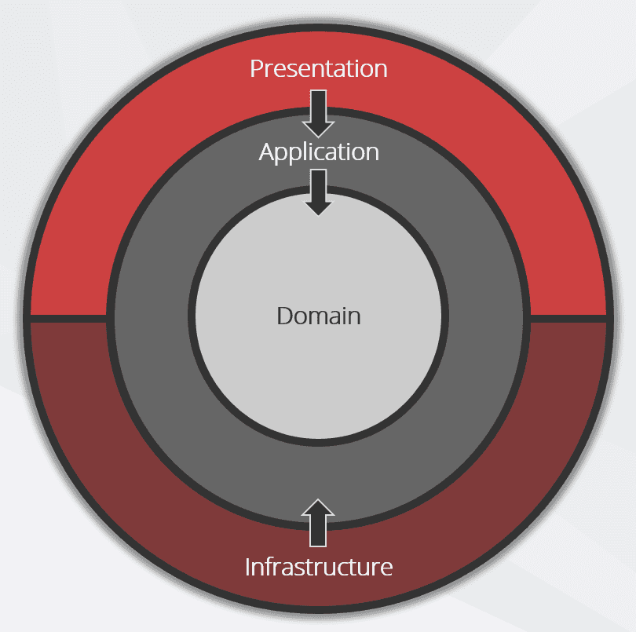

# ERP-sales
deploy backend: erp-sales-production.up.railway.app 


### Como rodar

API em produção: https://erp-sales-production.up.railway.app/
Frontend em produção: 
Documentação da api localmente: http://localhost:8080/docs
Em produção: https://erp-sales-production.up.railway.app/docs#/ 

Rodar na pasta raíz:
```
docker compose up -> não consegui testar localmente porque fiquei sem espaço no disco
```
- usar http:localhost:8080/api/v1 para backend]
- http:localhost:3000/ para frontend

Para rodar o backend 

```
cd backend &&
npm install -g nx &&
pnpm install &&
docker compose up -d &&
pnpm prisma generate --schema=shared/prisma-config/prisma/schema.prisma &&
pnpm run erp:migrate &&
pnpm run erp:seed &&
nx run-many --target=serve --projects=api-gateway,coupon-service,product-service --parallel

```
Para rodar o frontend
```
cd frontend
npm install &&
npm run dev &&
```


### Fase de Pesquisa

- Durante a fase de pesquisa e design técnico percebeu-se que algumas tecnologias pensadas inicialmente para desafio pessoal não seriam efetivas.

* Foi descartada a ideia de *1 banco de dados para cada 1* dos serviços do projeto, visto que o pequeno escopo do banco de dados é completamente interligado entre sí, precisando apenas de *1 banco*.

* Como o sistema não precisa de mensageria assíncrona foi decidido trocar o middleware de comunicação de *Kafka* para *gRPC*, por ser o mais performático para request/response e ter HTTP/2. Mas por fim foi optado usar protocolo *TCP* por conta do prazo.

* Foi escolhido usar os logs de erro em português para agilizar o entendimento


## Diagrama ER

<div style="width: 100%; display: flex; justify-content: center; align-items: center">

<div style="width: 800px;">


</div>

</div>

## Estrutura

* Foi escolhida uma estrutura de microsserviçps pensando em escalabilidade
* Em contrapeso à escalabilidade, foi usado Monorepo para reaproveitar e unificar o código
* Para o Front end foi escolhido um repositório separado
* Dessa forma o projeto é estruturado em Multirepo + Monorepo

## Arquitetura: Clean Architecture

<div style="width: 100%; display: flex; justify-content: center; align-items: center">

<div style="width: 400px;">



</div>

</div>

* Clean Architecture baseada nas versão de Steve "Ardalis" Smith
 * Domain: Entidades(com regras básicas), Interfaces de use cases e Repositórios - (fundamentos/core)
 * Application: Repositórios, Casos de uso - (implementação sem acoplamento externo) 
 * Infrastructure: Implementações reais com Banco, APIs, arquivos, Middlewares etc - (com acoplamento externo)
 * Presentation: DTOs/Validações com Clientes, Controllers - (adaptadores/portas para web)

* Monorepo, gerenciado com NX: libs e apps
 * apps: serviços reais
 * libs: código único e reaproveitável

* API-gateway como entrada e cliente do middleware de comunicação Kafka

## 🧠 Backend

# pastas principais
* libs com a estrutura presentation (controllers), infrastructure(banco de dados), presentation(use cases), domain (entidades)
* apps com api-gateway e os microsservios de fato

- **NestJS**: framework modular, com suporte nativo a TypeScript e ótima integração com arquitetura de microsserviços. Facilita a organização em camadas (DDD, Clean Architecture).
- **TCP**: permite comunicação desacoplada entre serviços, ideal para um sistema distribuído que precisa escalar módulos como descontos e cupons separadamente.
- **PostgreSQL**: banco de dados relacional robusto e amplamente utilizado, ideal para garantir integridade dos dados e facilitar joins entre entidades como produtos e cupons.
- **Prisma ORM**: fornece tipagem forte, velocidade de desenvolvimento e integração perfeita com NestJS + Postgres.
- **Zod**: utilizado para validações de dados tanto na entrada de APIs quanto nas pipelines internas dos serviços NestJS.
- **Docker + docker-compose**: facilita o ambiente de desenvolvimento e testes integrados com Kafka, Redis, NGINX e banco de dados.
- **Nx Monorepo**: permite gerenciar todos os serviços (backend e frontend) com CI/CD unificado, build incremental e reutilização de código entre libs.

## 🎨 Frontend

# pastas principais
* lib com hooks, stores, schemas e utils
* app com os components, pages, e layout

- **Next.js**: framework moderno baseado em React, com SSR e SSG ideais para projetos que envolvem SEO, como catálogos de produto.
- **React Query + Axios**: juntos oferecem cache, sincronização e refetch automático de dados com controle total de requisições HTTP.
- **Zustand**: biblioteca leve e intuitiva para controle de estado local/global, ideal para projetos que não exigem complexidade como Redux.
- **React Hook Form + Zod**: integração direta para validações declarativas e performance superior em formulários.
- **AntDesign + TailwindCSS**: proporcionam desenvolvimento rápido e responsivo com componentes acessíveis e estilização moderna e consistente.
