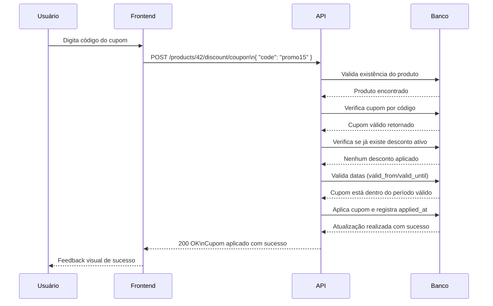
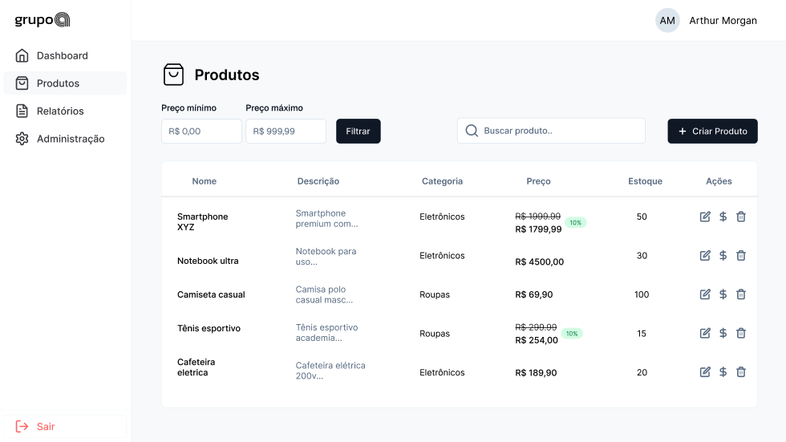

# 💻 Desafio Técnico – Desenvolvedor Fullstack Júnior

O Instituto Senai de Inovação está em busca de **desenvolvedores com perfil versátil**, capazes de atuar tanto no **backend quanto no frontend**, para resolver desafios reais e relevantes.  
Este desafio faz parte do nosso processo seletivo para a vaga de **Desenvolvedor Fullstack Júnior**.

O objetivo é avaliar sua **habilidade técnica**, **clareza de raciocínio**, **organização de código** e **capacidade de entregar uma aplicação funcional com base em requisitos enxutos**, algo que acontece com frequência em projetos de inovação.

Mais do que domínio técnico, valorizamos a **capacidade de pensar de forma estruturada**, escrever **código limpo**, seguir **boas práticas** e tomar **decisões conscientes** durante o desenvolvimento.

---

## ✅ O que esperamos ver no seu projeto

- Organização do projeto com **estrutura clara e lógica**
- Capacidade de construir uma **aplicação funcional**, mesmo com requisitos limitados
- Uso consistente de **boas práticas no frontend e backend**
- Uso de **Git** com histórico **coerente de commits**

---

## 🌟 Diferenciais técnicos que contam pontos

- **Código limpo e legível**, seguindo os princípios do *Clean Code* (nomes significativos, pequenas funções, baixo acoplamento, alta coesão)
- Arquitetura consistente, com **separação clara entre camadas** da aplicação (ex: MVC, DDD)
- **Tratamento de erros** e respostas HTTP padronizadas (mensagens claras e status codes corretos)
- **Testes automatizados** (unitários ou de integração ou E2E) com cobertura mínima dos fluxos principais – *não são obrigatórios, mas contam como diferencial*
- **Documentação técnica** clara no `README.md` explicando o setup, execução e decisões técnicas
- Interface com **responsividade básica**, priorizando **usabilidade**
- **Uso de Docker** (`Dockerfile` e/ou `docker-compose`) para facilitar o deploy e garantir portabilidade do ambiente, *não é obrigatório, mas será considerado um diferencial*
- **Uso consciente de bibliotecas externas** com explicações, quando necessário, das escolhas de dependência

---

## O que será avaliado

| Critério                                      | Peso    |
|-----------------------------------------------|---------|
| Estrutura e organização do projeto            | ★★★★★ |
| Aplicação correta das regras de negócio       | ★★★★☆ |
| Clareza e limpeza do código                   | ★★★★☆ |
| Tratamento de erros                           | ★★★☆☆ |
| README técnico completo                       | ★★★★☆ |
| Git com granularidade e histórico limpo       | ★★★☆☆ |
| Aderência a padrões REST e boas práticas HTTP | ★★★☆☆ |
| Experiência do Usuário (Frontend)             | ★★★★☆ |

## 🎯 Objetivo

Este desafio técnico tem como propósito simular um fluxo real de vendas dentro de um ambiente corporativo, focando no cadastro, listagem, edição e gerenciamento de produtos, bem como na aplicação de descontos com regras de negócio rigorosas e realistas. A ideia é proporcionar uma experiência próxima da realidade de sistemas de e-commerce ou ERPs modernos, exigindo atenção aos detalhes, domínio de boas práticas de desenvolvimento e compreensão sólida de integrações e processos de validação.

Você será responsável por desenvolver uma aplicação web fullstack, contemplando as seguintes funcionalidades principais:

- Cadastro de produtos com controle de **preço**, **estoque** e **unicidade de nome**
- Listagem de produtos com **filtros avançados** e **paginação**
- Aplicação e remoção de **descontos percentuais** ou **cupons promocionais**, seguindo regras específicas de negócio

A proposta visa não apenas testar a sua capacidade técnica e organização de projeto, mas também avaliar sua sensibilidade às regras de negócio, tratamento de exceções e comportamento frente a requisitos ambíguos ou propensos a falhas. Essa simulação aproxima-se dos desafios enfrentados por times de desenvolvimento que lidam com fluxos reais de negócio em empresas que prezam pela confiabilidade e manutenção da lógica da aplicação ao longo do tempo.

##  🧭 Stack Mínima Sugerida

### Backend

- [NestJS](https://nestjs.com): framework moderno e escalável que utiliza TypeScript por padrão e favorece uma arquitetura modular.  
- [Express.js](https://expressjs.com): framework web minimalista e flexível, bastante difundido para criação de APIs REST com Node.js.

**Observação:** Também é permitida a utilização de outras linguagens, como Java com Spring Boot, desde que a arquitetura web REST seja mantida e os requisitos sejam atendidos.

---

### Frontend

- **Biblioteca Base:** [ReactJS](https://react.dev)  
  Preferencialmente, utilize [ReactJS](https://react.dev), com ou sem frameworks adicionais. Esperamos a construção de **componentes reutilizáveis**, aplicação de um **controle de estado simples** com `useState`, `useEffect`, e, se necessário, [Context API](https://react.dev/learn/passing-data-deeply-with-context) para compartilhamento de estado global.

  A integração com a API backend deve ser clara, funcional e bem organizada (ex.: fetch/axios com tratamento de loading e erro).

- **Liberdade de Framework:**  
  Você tem **liberdade para utilizar frameworks baseados em React**, como:  
  - [Next.js](https://nextjs.org): oferece roteamento baseado em arquivos, SSR, SSG e ótimo suporte a SEO.  
  - [Remix](https://remix.run): traz uma abordagem centrada em rotas, com carregamento de dados no servidor, ideal para experiências rápidas e declarativas.

  Ambos são bem-vindos e aceitos neste desafio, desde que o projeto mantenha **clareza arquitetural, organização e cobertura dos requisitos funcionais**.

- **Liberdade de Biblioteca de Estado:**  
  Também é permitido utilizar a biblioteca de gerenciamento de estado de sua preferência, como:
  - [Zustand](https://zustand-demo.pmnd.rs/)
  - [Redux](https://redux.js.org/)
  - [Jotai](https://jotai.org/)
  - [Recoil](https://recoiljs.org/)
  - Ou outras de sua escolha

  O mais importante é que a implementação seja **bem estruturada, compreensível e adequada à complexidade da aplicação**.

- **Outras Bibliotecas/Frameworks:**  
  Frameworks modernos como Vue.js ou Angular também são aceitos, desde que respeitem a arquitetura proposta e cumpram todos os requisitos funcionais com clareza.

###   Banco de Dados

- **Tipo:** Relacional em memória ou Relacional
- **Exemplo:** SQLite utilizando `':memory:'` como caminho para rodar totalmente em memória.

**Alternativas Aceitas:**

- **H2** ou **HSQLDB** (para implementações em Java)  
- [`better-sqlite3`](https://github.com/WiseLibs/better-sqlite3) no Node.js (com suporte a `':memory:'`)  
- Qualquer outro banco relacional leve, desde que mantenha a **persistência temporária ou fixa** (Postgres, MySQL) e seja fácil de configurar para fins de teste e demonstração

## Backend

### Módulo: Produtos e Descontos

Você deverá criar:

- **Backend com API RESTful** para produtos e cupons, incluindo:
  - Endpoints para **criação**, **edição**, **inativação** (soft delete) e **listagem paginada** de produtos
  - Endpoints para **aplicar e remover descontos percentuais** e **cupons promocionais**
  - **Validações de unicidade**, integridade referencial e regras específicas de negócio

- **Frontend funcional**, contendo:
  - Listagem de produtos com **paginação**, **busca** e **filtros** (nome, faixa de preço, com ou sem desconto)
  - **Formulário de cadastro e edição** de produtos (com suporte a atualização via patch)
  - Interface para **aplicar e remover cupons/descontos**, com **feedback visual claro**
  - **Destaques visuais** para produtos com estoque zerado ou com desconto ativo

- **Validações robustas**, cobrindo:
  - **Formatos de preço**, normalização de nome e restrições de valor
  - Prevenção à **aplicação múltipla de descontos** no mesmo produto
  - Rejeição de **cupons inválidos, expirados** ou que resultem em valor final **abaixo de R$ 0,01**
  - Retorno de **códigos HTTP apropriados** para erros esperados (`422`, `409`, `412`, entre outros)

## 🚨 Funcionalidades Obrigatórias

### Listagem de Produtos

Deve ser possível:

- Visualizar uma tabela com as colunas:
  - Nome
  - Descrição
  - Estoque atual
  - Preço original
  - Preço com desconto (se aplicável)
- Exibir badges ou indicadores visuais para:
  - Produtos com desconto ativo
  - Produtos com estoque zerado
- Filtrar produtos por:
  - Nome (busca textual)
  - Faixa de preço (mínimo e máximo)
  - Com ou sem desconto ativo (booleano)
- Paginar os resultados com paginação padrão de **10 por página**

## 🧾 Query Params Aceitos

Os seguintes parâmetros podem ser utilizados para refinar a listagem de produtos:

- **`page`** (`integer ≥ 1`): número da página atual.
- **`limit`** (`integer`, entre 1 e 50): quantidade de itens por página.
- **`search`** (`string`): busca textual no nome ou descrição do produto.
- **`minPrice` / `maxPrice`** (`decimal`): filtro por faixa de preço mínima e máxima.
- **`hasDiscount`** (`boolean`): `true` ou `false` para filtrar produtos com ou sem desconto.
- **`sortBy`** (`string`): campo para ordenação. Valores possíveis: `name`, `price`, `created_at`, `stock`.
- **`sortOrder`** (`string`): direção da ordenação. Pode ser `asc` ou `desc`.
- **`includeDeleted`** (`boolean`): se `true`, inclui produtos inativos (soft deleted). Recomendado apenas para administradores.
- **`onlyOutOfStock`** (`boolean`): se `true`, retorna apenas produtos com estoque igual a zero.
- **`withCouponApplied`** (`boolean`): se `true`, retorna apenas produtos que possuem cupom promocional aplicado.

#### Requisitos Adicionais

- Garantir que a ordenação por **nome**, **preço** e **estoque** seja suportada em ambas as direções (`asc` e `desc`).
- Retornar resposta **`200 OK`** com uma **lista vazia** caso nenhuma correspondência seja encontrada.
- Adotar comportamento consistente de **paginação**, mesmo quando não houver resultados.  
  Exemplo: se `page=10` não possui itens, ainda assim deve retornar um array vazio com os metadados corretos (`page`, `limit`, `totalItems`, `totalPages`).

### Cadastro de Produto

O cadastro de produtos deve ser feito com especial atenção às validações de regras de negócio, estrutura dos campos e consistência dos dados. A aplicação deverá ser robusta o suficiente para impedir erros simples e respeitar todas as regras de domínio.

#### Campos obrigatórios

- **`name`** (string, obrigatório)  
  - Deve ser único após normalização (remover espaços duplicados)  
  - Mínimo: 3 caracteres  
  - Máximo: 100 caracteres  
  - Regex recomendado: `^[a-zA-Z0-9\s\-_,.]+$`  

- **`description`** (string, opcional)  
  - Máximo: 300 caracteres  

- **`stock`** (integer, obrigatório)  
  - Valor mínimo: 0  
  - Valor máximo: 999999  

- **`price`** (decimal, obrigatório)  
  - Mínimo: 0.01  
  - Máximo: 1.000.000,00  
  - Deve aceitar formatos brasileiros (ex: "1.234,56") e internacionais (ex: 1234.56), mas ser persistido corretamente como decimal  

- **`created_at`** (ISODate, obrigatório)  
  - Deve ser preenchido com a data/hora atual no momento do cadastro  
  - Deve ser imutável após criação  
  - Deve estar no passado ou presente (nunca no futuro)

#### Regras obrigatórias

- O campo **`name`** deve ser único no banco mesmo após normalização.  
- Produtos com **`stock == 0`** devem ser destacados na listagem com um badge visual **"Esgotado"**.  
- O valor original nunca deve ser alterado por descontos. Os **descontos devem ser armazenados separadamente**.  
- O **valor com desconto** (se houver) deve ser sempre **recalculado dinamicamente** e **não salvo** de forma persistente no banco.  
- É proibido criar produtos com o **preço com desconto menor que R$ 0,01**.  
- O campo **`created_at`** deve refletir corretamente a **data/hora da criação** e **não pode ser editado posteriormente**.  
- Adicionar o campo **`updated_at`** para rastrear modificações (**opcional, mas recomendado**).

### Aplicação de Descontos

#### Tipos permitidos

- **Desconto percentual direto:**  
  O produto pode receber um **desconto percentual**, aplicado diretamente sobre o valor original.  
  - O valor do desconto deve estar entre **1% e 80%**.  
  - O cálculo do valor final deve ser feito de forma dinâmica no momento da exibição da tabela.  
  - Este tipo de desconto não requer código promocional e é aplicado automaticamente conforme regras do sistema (ex: campanhas sazonais, queima de estoque etc.).

- **Cupom promocional:**  
  O sistema deve permitir a aplicação de **cupons promocionais**, que podem ser de dois tipos:  
  - **fixed** (ex: R$ 50 de desconto)  
  - **percent** (ex: 10%, 25% etc.)

  Os cupons devem ser **previamente cadastrados no sistema** e conter:  
  - Um **código único identificador**, como `PROMO10`, `QUERO25`, etc.  
  - Uma regra de validade (data de expiração ou quantidade de usos).  
  - Um tipo (fixed ou percent) e valor correspondente.  
  - Aplicação dinâmica no checkout, sem persistência do valor com desconto.

  > ⚠️ É responsabilidade do sistema validar se o cupom é válido, aplicável ao produto, e se respeita os limites mínimos de valor final (por exemplo, não permitir que o produto fique abaixo de R$ 0,01).

#### Regras

- **Apenas um único desconto pode estar ativo por produto.**  
  Caso já exista um desconto aplicado (seja percentual ou via cupom), a tentativa de aplicar outro deve resultar em erro **`409 Conflict`**.

- **Validações para cupons promocionais**  
  Todo cupom promocional deve conter os seguintes campos e validações obrigatórias:

  - **`code`** (string, obrigatória e única)  
    - Deve ter entre **4 e 20 caracteres**  
    - Apenas **caracteres alfanuméricos** (sem símbolos especiais)  
    - **Sem espaços**  
    - Deve ser **normalizado**: remover acentos, converter para lowercase  
    - Códigos reservados como `admin`, `auth`, `null`, `undefined` devem ser **rejeitados**  
    - Deve ser **único no banco**, considerando a versão normalizada do código  

  - **`type`** (`fixed` ou `percent`)  
    - Campo **obrigatório**  
    - Somente os valores **`fixed`** ou **`percent`** são aceitos  
    - Qualquer outro valor deve gerar erro **`400 Bad Request`**  

  - **`value`** (número, obrigatório)  
    - Se **`type == percent`**, o valor deve estar entre **1 e 80**  
    - Se **`type == fixed`**, o valor monetário deve ser **positivo** (ex: R$ 10.00)  

  - **`oneShot`** (booleano, obrigatório)  
    - Se **`true`**, o cupom pode ser usado **apenas uma vez por produto**  
    - Aplicações repetidas do mesmo cupom no mesmo produto devem retornar **`409 Conflict`**  

  - **`valid_from`** / **`valid_until`** (datas ISO, obrigatórias)  
    - **`valid_from`** define a data/hora em que o cupom se torna válido  
    - **`valid_until`** define a data limite de validade do cupom  
    - A **data atual** deve estar **entre `valid_from` e `valid_until`** para que o cupom seja aceito  
    - O valor de **`valid_until` deve ser maior que `valid_from`**  
    - A validade máxima permitida para cupons é de **5 anos** a partir de `valid_from`

#### Regras adicionais

- Cupons **fora da janela de validade** (ou seja, com a data atual anterior a `valid_from` ou posterior a `valid_until`) devem ser **rejeitados com erro `400 Bad Request`**.

- Cupons que resultem em um **preço final inferior a R$ 0,01** devem ser **rejeitados com erro `422 Unprocessable Entity`**.  
  Essa validação deve ocorrer **antes da persistência** e impedir a conclusão da operação.

- A **aplicação de descontos** (seja percentual ou por cupom) deve ocorrer de forma **transacional**.  
  Ou seja, o cupom, o vínculo ao produto e o cálculo do valor com desconto devem ser tratados como uma única operação atômica evitando estados inconsistentes no banco de dados.

- A **remoção de um desconto** (cancelamento ou expiração) deve **restaurar automaticamente o valor original** do produto na exibição.  
  Importante: o campo **`price`** deve **sempre manter o valor original** do produto, o valor com desconto nunca deve ser salvo diretamente nesse campo.

## Documentação dos principais endpoints

> ⚠️ Esta documentação apresenta uma **sugestão de estrutura para os endpoints da API**.  
> Ela serve como base para implementação e validação dos requisitos funcionais descritos no desafio.  
> Adaptações podem ser feitas conforme a arquitetura adotada, desde que respeitem os princípios RESTful e garantam clareza e consistência no uso da API.

Base URL: `/api/v1`
Todos os exemplos usam JSON. Datas em ISO-8601 (UTC).

### 2.1 Produtos

| Método & Rota                     | Descrição                             | Status codes principais |
|-----------------------------------|---------------------------------------|-------------------------|
| `GET /products`                   | Lista paginada com filtros avançados. | 200                     |
| `GET /products/{id}`              | Detalhes de um produto.               | 200, 404                |
| `POST /products`                  | Cria produto.                         | 201, 400, 409           |
| `PATCH /products/{id}`            | Atualização parcial via JSON Patch;   | 200, 400, 404, 412      |
| `DELETE /products/{id}`           | Inativa (soft-delete) o produto.      | 204, 404                |
| `POST /products/{id}/restore`     | Restaura produto inativo.             | 200, 404                |
| `POST /products/{id}/discount/percent` | Aplica desconto percentual.           | 200, 400, 409, 422      |
| `POST /products/{id}/discount/coupon`  | Aplica cupom promocional.             | 200, 400, 404, 409, 422 |
| `DELETE /products/{id}/discount`  | Remove desconto ativo.                | 204, 404                |

#### 2.1.1 GET /products

```
GET /api/v1/products?page=1&limit=10&search=cafe&minPrice=100&hasDiscount=true
Accept: application/json
```

Query params: `page`, `limit`, `search`, `minPrice`, `maxPrice`, `hasDiscount`, `sortBy`, `sortOrder`, `includeDeleted`, `onlyOutOfStock`, `withCouponApplied`

```json
{
  "page": 1,
  "limit": 10,
  "search": "cafe",
  "minPrice": 100,
  "maxPrice": 1000,
  "hasDiscount": true,
  "sortBy": "name",
  "sortOrder": "asc",
  "includeDeleted": false,
  "onlyOutOfStock": false,
  "withCouponApplied": false
}
```

Exemplo de Resposta 200

```json
{
  "data": [
    {
      "id": 42,
      "name": "Café Premium",
      "description": "100% arábica",
      "stock": 3,
      "is_out_of_stock": false,
      "price": 2590,
      "finalPrice": 2201,
      "discount": {
        "type": "percent",
        "value": 15,
        "applied_at": "2025-06-04T18:15:21Z"
      },
      "hasCouponApplied": true,
      "created_at": "2025-05-30T12:00:00Z",
      "updated_at": "2025-06-01T09:20:05Z"
    }
  ],
  "meta": {
    "page": 1,
    "limit": 10,
    "totalItems": 1,
    "totalPages": 1
  }
}
```

##### Observações

- `discount` deve ser `null` quando não houver desconto ativo ou se o desconto estiver expirado.
- Produtos inativos só devem aparecer na listagem se o parâmetro `includeDeleted=true` for utilizado.

#### 2.1.2 POST /products

```
POST /api/v1/products
Content-Type: application/json
```

```json
{
  "name": "Café Premium",
  "description": "100% arábica",
  "stock": 250,
  "price": 2590
}
```

Cria produto e devolve cabeçalho `Location: /products/{id}`.

**Erros**

- `400 Bad Request` – Corpo da requisição inválido, falha na regex, preço negativo, campo `created_at` com data futura, entre outros erros de validação.
- `409 Conflict` – Nome duplicado no banco de dados após normalização (remoção de acentos, espaços extras, conversão para lowercase).

#### 2.1.3 PATCH /products/{id}

Cabeçalho obrigatório:
`Content-Type: application/json-patch+json`

Exemplo de patch:

```json
[
  { "op": "replace", "path": "/stock", "value": 300 },
  { "op": "replace", "path": "/price", "value": 2790 }
]
```

### 2.2 Cupons

| Método & Rota       | Descrição           |
|---------------------|---------------------|
| `GET /coupons`      | Lista / busca códigos. |
| `POST /coupons`     | Cria cupom.         |
| `GET /coupons/{code}` | Detalhes de cupom.  |
| `PATCH /coupons/{code}`| Edita (exceto code).|
| `DELETE /coupons/{code}`| Inativa cupom.      |

#### Modelo de cupom

```json
{
  "code": "promo10",
  "type": "percent",
  "value": 10,
  "oneShot": false,
  "valid_from": "2025-06-01T00:00:00Z",
  "valid_until": "2027-06-01T00:00:00Z"
}
```

#### Validações

- O campo `code` deve ser **único** após **normalização** (remoção de acentos, conversão para lowercase e remoção de espaços).
- O campo `type` deve estar contido no conjunto `{ "fixed", "percent" }`.
- O campo `value` deve respeitar:
  - Para `type = "percent"`: valor entre **1 e 80**.
  - Para `type = "fixed"`: valor **monetário positivo** (maior que 0).
- O campo `valid_until` deve ser uma data **posterior a `valid_from`** e com no máximo **5 anos de diferença** entre elas.

### 2.3 Códigos de erro globais

| Código                   | Quando ocorre                                                                                             |
|--------------------------|-----------------------------------------------------------------------------------------------------------|
| 400 Bad Request          | Violação de validação; campo imutável; cupom expirado ou ainda não válido.                                |
| 409 Conflict             | Tentar cadastrar nome normalizado já existente; aplicar segundo desconto; cupom oneShot reutilizado.      |
| 422 Unprocessable Entity | Desconto faz preço cair < R$ 0,01.                                                                        |
| 404 Not Found            | Recurso inexistente ou inativo sem `includeDeleted=true`.                                                 |
| 500 Internal Server Error| Falha inesperada (transação revertida).                                                                   |

### 2.4 Estrutura de Tabelas Sugeridas

A modelagem relacional proposta inclui três tabelas principais:

###   `products` (Produtos)

| Campo         | Tipo      | Descrição                                          |
|---------------|-----------|----------------------------------------------------|
| `id`          | INTEGER   | Identificador único do produto (PK).               |
| `name`        | STRING    | Nome do produto.                                   |
| `description` | STRING    | Descrição do produto (opcional, até 300 caracteres). |
| `price`       | DECIMAL   | Preço original (mínimo 0,01; formato decimal).     |
| `stock`       | INTEGER   | Quantidade disponível em estoque (0 a 999 999).    |
| `created_at`  | DATETIME  | Timestamp de criação (não editável).               |
| `updated_at`  | DATETIME  | Timestamp da última atualização (opcional).        |
| `deleted_at`  | DATETIME  | Timestamp de inativação soft-delete (opcional).    |

---

###   `coupons` (Cupons de Desconto)

| Campo          | Tipo      | Descrição                                                                                         |
|----------------|-----------|---------------------------------------------------------------------------------------------------|
| `id`           | INTEGER   | Identificador único do cupom (PK).                                                                |
| `code`         | STRING    | Código único do cupom (ex: `"SAVE10"`). Deve ser normalizado (lowercase, sem acentos ou espaços). |
| `type`         | ENUM      | Tipo de desconto: `"percent"` ou `"fixed"`.                                                       |
| `value`        | DECIMAL   | Valor do desconto:<br>- Percentual: `1–80` (para 1% a 80%)<br>- Fixo: valor monetário (> 0).       |
| `one_shot`     | BOOLEAN   | Se `true`, só pode ser usado uma única vez por produto.                                           |
| `max_uses`     | INTEGER   | Número máximo de usos permitidos (quando `one_shot = false`).                                      |
| `uses_count`   | INTEGER   | Contador de quantas vezes o cupom já foi aplicado.                                                |
| `valid_from`   | DATETIME  | Data/hora em que o cupom se torna válido.                                                         |
| `valid_until`  | DATETIME  | Data/hora de expiração do cupom (máx. 5 anos após `valid_from`).                                  |
| `created_at`   | DATETIME  | Timestamp de criação (não editável).                                                              |
| `updated_at`   | DATETIME  | Timestamp da última atualização (opcional).                                                       |
| `deleted_at`   | DATETIME  | Timestamp de inativação soft-delete (opcional).                                                   |

---

### `product_coupon_applications` (Relação Produto ↔ Cupom Aplicado)

Tabela responsável por registrar a **aplicação de um cupom promocional** a um produto.  
Cada produto pode ter **no máximo um cupom aplicado por vez**.  
Essa estrutura garante o controle transacional da aplicação e remoção de descontos, respeitando a regra de exclusividade.

| Campo          | Tipo      | Descrição                                                         |
|----------------|-----------|-------------------------------------------------------------------|
| `id`           | INTEGER   | Identificador único da aplicação (PK).                            |
| `product_id`   | INTEGER   | Chave estrangeira para `products.id`.                             |
| `coupon_id`    | INTEGER   | Chave estrangeira para `coupons.id`.                              |
| `applied_at`   | TIMESTAMP | Data/hora da aplicação do cupom (ISO 8601 UTC).                  |
| `removed_at`   | TIMESTAMP | Data/hora da remoção do cupom (nulo enquanto ativo).             |

**Regras adicionais:**

- Um produto pode ter **apenas um registro ativo por vez** (`removed_at IS NULL`).
- A tentativa de aplicar um novo cupom enquanto outro estiver ativo deve resultar em **erro `409 Conflict`**.
- A aplicação e remoção devem ocorrer de forma **transacional**, garantindo consistência.
- Após remoção, o sistema deve exibir o valor original (`price`) do produto, sem alterar permanentemente seu valor base.

## Fluxo Ideal de Uso: Cadastro de Produto com Cupom e Remoção de Desconto

Este fluxo representa o caminho ideal de uso da aplicação, cobrindo o cadastro de produto, criação e aplicação de cupom de desconto, consulta do produto com desconto aplicado e remoção do desconto.

### 🧩 Passo a Passo

1. **Criar um produto**
   - `POST /products`
   - Exemplo: cria um produto chamado **"Café"**, que será retornado com `id = 42`.

2. **Cadastrar um cupom de desconto**
   - `POST /coupons`
   - Exemplo: cria um cupom com o código `"promo15"`.

3. **Aplicar o cupom ao produto**
   - `POST /products/42/discount/coupon`
   - Corpo da requisição (JSON):

     ```json
     {
       "code": "promo15"
     }
     ```

   - Resultado: o produto passa a exibir o preço com o desconto aplicado, conforme as regras definidas pelo cupom.

4. **Consultar o produto com o desconto aplicado**
   - `GET /products/42`  
   - A resposta inclui uma seção `discount`, com detalhes do desconto atual.

5. **Remover o desconto aplicado**
   - `DELETE /products/42/discount`  
   - O preço do produto volta ao valor original, sem desconto.



> 💡 Os passos de 2 a 5 podem ser encapsulados em uma mesma transação caso seja necessário garantir **consistência transacional**.

## Frontend

A interface do sistema deve ser desenvolvida com base no **mockup de referência** apresentado abaixo.  
Embora **não seja necessário seguir o design com precisão pixel a pixel**, espera-se que o **fluxo de interação, a disposição dos elementos e a estrutura geral da tela** (ex: tabela, filtros, botões) sejam respeitados e reflitam a proposta visual fornecida.

Você tem **total liberdade para escolher a biblioteca ou framework de frontend** que preferir.  
Será dada preferência para implementações em [ReactJS](https://react.dev), mas qualquer solução moderna que atenda aos requisitos funcionais será aceita.

### Exemplos de bibliotecas e frameworks aceitos

- [ReactJS](https://react.dev)
- [Next.js](https://nextjs.org)
- [Remix](https://remix.run)
- [Vue.js](https://vuejs.org)

### Exemplos de bibliotecas de UI e estilização

- [TailwindCSS](https://tailwindcss.com)
- [Shadcn/UI](https://ui.shadcn.com)
- [Material UI](https://mui.com)
- [Chakra UI](https://chakra-ui.com)
- [Bootstrap](https://getbootstrap.com)
- CSS tradicional, SCSS, ou soluções CSS-in-JS como [styled-components](https://styled-components.com) e [Emotion](https://emotion.sh)

### Bibliotecas de gerenciamento de estado (opcionais)

Você pode utilizar qualquer biblioteca para gerenciar o estado da aplicação, conforme sua familiaridade ou necessidade do projeto. Exemplos:

- [Redux Toolkit](https://redux-toolkit.js.org)
- [Zustand](https://zustand-demo.pmnd.rs)
- [Jotai](https://jotai.org)
- [Recoil](https://recoiljs.org)
- [Context API (nativo do React)](https://react.dev/learn/passing-data-deeply-with-context)

### Bibliotecas auxiliares (opcionais)

É permitido o uso de bibliotecas que otimizem a manipulação de formulários, chamadas assíncronas e validações, desde que **seu uso seja justificado** tecnicamente no projeto. Exemplos:

- [React Hook Form](https://react-hook-form.com) — gerenciamento eficiente de formulários com integração a validações
- [React Query](https://tanstack.com/query/latest) — para controle de estados de requisição, cache e sincronização com servidor
- [Axios](https://axios-http.com) ou `fetch` para chamadas HTTP
- [Formik](https://formik.org) — alternativa para controle de formulários
- [Yup](https://github.com/jquense/yup) ou [Zod](https://zod.dev) — para validação de schemas de dados

> 💡 Ao Utilize essas bibliotecas, informe a necessidade ou motivo por exemplo no README, para que possamos entender a necessidade do uso dessa ou de qualquer outra lib.

---

### 🎯 Objetivo do Frontend

O objetivo principal da interface é entregar uma experiência de uso fluida, clara e funcional.  
Espera-se uma aplicação com **alta usabilidade**, **acessibilidade básica** e foco na **qualidade do código**  considerando organização, padronização, legibilidade e boas práticas de desenvolvimento frontend.

Além da fidelidade ao fluxo proposto no mockup, a implementação deve demonstrar domínio técnico na construção de componentes reutilizáveis, tratamento adequado de estados e formulários, e feedback visual eficaz ao usuário.

---

### ✅ Funcionalidades obrigatórias do frontend

A aplicação deve conter, no mínimo, as seguintes funcionalidades implementadas:

- **Tabela paginada de produtos**, com:
  - Filtros por **nome**, **faixa de preço** e **status de desconto**
  - Colunas: **nome**, **descrição**, **estoque**, **preço original** e **preço com desconto**
  - Destaques visuais para:
    - Produtos **esgotados** (badge ou rótulo com "Esgotado")
    - Produtos com **desconto ativo**

- **Formulário de cadastro e edição de produto**
  - Com validações de campos e **mensagens de erro claras e acessíveis**
  - Estrutura consistente para inserção e atualização dos dados

- **Modal para aplicação de cupom promocional**
  - Permite informar o código do cupom e aplicá-lo ao produto selecionado
  - Exibe **feedback imediato** em caso de sucesso ou erro  
    - Ex: cupom **inválido**, **expirado**, ou do tipo `oneShot` já utilizado anteriormente

- **Botão para remoção de desconto**
  - Disponível na interface do produto
  - Deve refletir a alteração imediatamente na listagem e/ou na visualização de detalhes

### 📐 **Mockup de Interface no Figma**

Para acessar o mockup de interface do usuário, utilize o link abaixo.

🔗 [Clique aqui para abrir o mockup no Figma](https://www.figma.com/design/s5QC0ms0OqZJFVrVIKjJq3/GrupoA?node-id=1-5&t=lVJlkX7Y6aAMp3LS-1)



## 📘 Requisitos do README.md

O `README.md` deve conter os seguintes tópicos:

1. **Como rodar o projeto**
   - Instruções para executar o projeto localmente (por exemplo: `npm install && npm run dev`)
   - Incluir um arquivo `.env.example` com as variáveis de ambiente necessárias para configuração

2. **Estrutura do projeto**
   - Listar as principais pastas do projeto
   - Descrever brevemente a função de cada uma (ex: `/components`, `/pages`, `/services`)

3. **Tecnologias utilizadas**
   - Informar as bibliotecas e frameworks principais utilizados
   - Exemplos esperados: `ReactJS`, `TailwindCSS`, `Axios`, `NestJS`, `Prisma`

---

## 📩 Entrega Parcial é Bem-vinda

Sabemos que o tempo e a complexidade podem variar para cada participante.  
Por isso, **mesmo que nem todas as funcionalidades tenham sido implementadas**, você pode **encaminhar o desafio mesmo incompleto**.

O objetivo é também avaliar sua **organização de código**, **clareza técnica**, **arquitetura**, e **boas práticas aplicadas**, independentemente do nível de conclusão funcional.

✅ Ao enviar o que já foi feito, nossa equipe técnica irá revisar o código com atenção e fornecer **feedback construtivo**, destacando os pontos positivos, boas decisões e oportunidades de melhoria.

> 💡 **Dica:** Caso envie parcialmente, aproveite o `README.md` para explicar suas escolhas, dificuldades encontradas e o que pretendia implementar a seguir.

---

## 📦 Como Enviar Sua Entrega

Para padronizarmos o recebimento e garantir que nada se perca no processo, siga as instruções abaixo:

1. **Compactação do Projeto**:
   - Compacte seu projeto em um arquivo `.zip` contendo todo o código-fonte, incluindo o `README.md`.

2. **Nomeação do Arquivo**:
   - Nomeie o arquivo com seu nome completo (exemplo: `igor_conde_desafio_fullstack.zip`).

3. **Envio por E-mail**:
   - **Assunto**: Use o seguinte título padrão:  
     `[Entrega Desafio Técnico] Nome Completo – Desenvolvedor(a) Fullstack`  
     Exemplo: `[Entrega Desafio Técnico] Igor Conde – Desenvolvedor Fullstack`

   - **Corpo do E-mail**:
     - Escreva seu nome completo novamente.
     - Adicione, se desejar, um breve comentário sobre o envio.

   - **Anexo**: Anexe o arquivo `.zip` ao e-mail.

4. **Destinatário**:
   - Envie para: `igor.conde@sistemafiepe.org.br`

---

Boa sorte! 🚀
